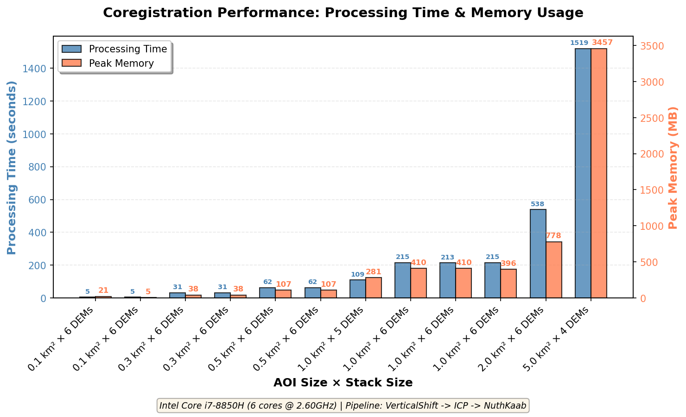

# fetch-arcticdem

A set of Python CLI tools for fetching and processing ArcticDEM strip DEMs from STAC catalogs. Supports automated cloud masking, reprojection, and lightweight coregistration using xdem.

> **Note on Coregistration**: The coregistration workflows implemented here provide a lightweight first-pass alignment suitable for exploratory analysis and visualization. They are not rigorous geodetic solutions. Users requiring precise coregistration for scientific applications should carefully validate results and consider more sophisticated approaches.

<details>
<summary><b>What is "lightweight first-pass alignment"?</b></summary>

The coregistration is considered "lightweight" because it uses simplified assumptions compared to rigorous geodetic workflows:

1. **Static stable ground mask**: The inlier mask identifying stable terrain is generated once from the reference DEM's slope (paramaterized, but default is 2-30 degrees) and never updated opposed to iteratively refining this mask after each transformation step to exclude areas of real change or remaining misalignment.

2. **No validation between steps**: A fixed pipeline (e.g., VerticalShift -> ICP -> NuthKaab) is applied without statistically validating whether each step improved alignment or checking for residual systematic biases.

3. **Global transformation assumption**: A single transformation is applied uniformly across the entire DEM extent, ignoring potential spatially-varying distortions, elevation-dependent biases, or terrain-specific errors that would require blockwise coregistration or bias-correction approaches.

For applications requiring sub-meter precision (e.g., tectonic deformation, precise volume change), users should validate results against independent ground control and consider more sophisticated coregistration workflows with iterative outlier detection and spatial bias modeling.

</details>

## Table of Contents

- [What This Tool Does](#what-this-tool-does): Overview of the project's purpose and main features.  
- [Prerequisites](#prerequisites): Software and environment requirements to run the tools.  
- [Installation](#installation): How to clone the repo and create the Conda/Micromamba environment.  
- [Quick Start](#quick-start): Minimal examples to fetch and (optionally) coregister DEMs.  
  - [Minimal Example: Fetch and Coregister DEMs](#minimal-example-fetch-and-coregister-dems): A short, copy-pastable command sequence to get started.  
- [CLI Commands](#cli-commands): Summary of the three primary command-line scripts and their roles.  
  - [fetch_arcticdem.py](#fetch_arcticdempy): Fetch, mask, reproject, and export ArcticDEM strips as COGs.  
  - [coregister_arcticdem.py](#coregister_arcticdempy): Coregister a DEM stack using xdem methods (lightweight first-pass).  
  - [fetch_and_coregister.py](#fetch_and_coregisterpy): Combined workflow that runs fetch + coregister in one command.  
- [Technical Notes](#technical-notes): Details about dataset coverage, CRS, licensing, and caveats.  
  - [ArcticDEM Dataset](#arcticdem-dataset): Short note on coverage and where to explore the data.  
  - [Metadata Preservation](#metadata-preservation): Which ArcticDEM metadata fields are retained in outputs.  
  - [Coregistration Methods](#coregistration-methods): Summary of the xdem methods implemented and their purpose.  
- [Known Limitations](#known-limitations): Important caveats and when to avoid using the lightweight coregistration.  
- [Output Files](#output-files): What files the scripts produce and their naming conventions.  
- [Contributing](#contributing): How to contribute, reporting issues, and linting requirements.  
- [License](#license): Project licensing information.  
- [References](#references): Links to ArcticDEM, xdem, and PGC documentation.

## What This Tool Does

`fetch-arcticdem` provides three command-line tools for working with [ArcticDEM](https://www.pgc.umn.edu/data/arcticdem/) strip DEMs:

1. **Fetch DEMs**: Query and download ArcticDEM strips via STAC, apply automated quality masks, and export as cloud-optimized GeoTIFFs
2. **Coregister DEMs**: Apply 3D affine transformations to align DEM stacks using [xdem](https://xdem.readthedocs.io/en/latest/index.html) coregistration methods
3. **Combined Workflow**: Execute both steps in a single command


**Workflow:**
- Input: Area of Interest (any GeoPandas-readable vector file or bounding box coordinates)
- STAC query to ArcticDEM catalog
- Filter by date range, spatial coverage, and data quality
- Download and apply automated masks (water, clouds, edges)
- Reproject to target horizontal CRS (default: native EPSG:3413)
- Export as Cloud-Optimized GeoTIFFs
- Optional: Generate multidirectional hillshade rasters
- Optional: Coregister stack using xdem (VerticalShift, ICP, NuthKaab, etc.)
- Output: Time-stamped, aligned DEMs ready for analysis

## Prerequisites

This tool depends on specific versions of GDAL, rasterio, xarray, and other geospatial libraries. The recommended way to install these is by using a dedicated Conda environment to prevent conflicts with existing installations.

> **Important**: Estimated disk usage after creating the conda/micromamba environment (conda-forge, python=3.11 + listed deps): ~1.6 GB (measured on Linux x86_64 with micromamba). ~1.0 GB is Python packages under lib/python3.11 (site-packages), ~0.4 GB are other compiled libraries under lib (GDAL/PROJ, C/C++ libs), and the remaining ~0.2 GB is binaries, headers, data files and metadata (bin, include, share, conda-meta, etc.). Reducing this environment is currently under development.

**Install Conda:** If you don't have it, install [Miniconda](https://docs.conda.io/en/latest/miniconda.html) or [Micromamba](https://mamba.readthedocs.io/en/latest/installation/micromamba-installation.html) (recommended for faster performance).

## Installation

1. **Clone the Repository:**
   ```bash
   git clone https://github.com/YOUR-USERNAME/fetch-arcticdem.git
   cd fetch-arcticdem
   ```

2. **Create and Activate the Environment:**

   * **Using Conda:**
     ```bash
     conda env create -f environment.yml
     conda activate fetch-arcticdem
     ```

   * **Using Micromamba:**
     ```bash
     micromamba create -f environment.yml
     micromamba activate fetch-arcticdem
     ```

## Quick Start

### Minimal Example: Fetch and Coregister DEMs

```bash
# Fetch DEMs for an area of interest
python scripts/fetch_arcticdem.py \
  --aoi_file /path/to/your/aoi.geojson \
  --output_dir ./output/dems \
  --date_range 2020-01-01 2023-12-31

# Coregister the fetched DEMs
python scripts/coregister_arcticdem.py \
  --input_dir ./output/dems \
  --output_dir ./output/coregistered

# Or run both steps together
python scripts/fetch_and_coregister.py \
  --aoi_file /path/to/your/aoi.geojson \
  --fetch_output_dir ./output/dems \
  --coreg_output_dir ./output/coregistered \
  --date_range 2020-01-01 2023-12-31
```

You can also use bounding box coordinates (WGS84) instead of a file:
```bash
python scripts/fetch_arcticdem.py \
  --bounds -18.85 64.03 -18.75 64.08 \
  --output_dir ./output/dems \
  --date_range 2020-01-01 2023-12-31
```

## CLI Commands

### `fetch_arcticdem.py`

Fetch ArcticDEM DEMs from STAC and save as cloud-optimized GeoTIFFs.

<details>
<summary><b>Click to expand arguments</b></summary>

| Argument | Type | Default | Description |
|----------|------|---------|-------------|
| `--aoi_file` | str | *required* | Path to AOI file (any format GeoPandas can read: GeoJSON, Shapefile, KML, etc.) |
| `--bounds` | float × 4 | *required* | Alternative to `--aoi_file`: WGS84 bounds as `minx miny maxx maxy` |
| `--output_dir` | str | *required* | Output directory for results |
| `--stac_url` | str | `https://stac.pgc.umn.edu/api/v1/` | STAC API URL for ArcticDEM catalog |
| `--collection` | str | `arcticdem-strips-s2s041-2m` | STAC collection ID. See [PGC STAC Endpoint](https://stac.pgc.umn.edu/api/v1/) for available collections |
| `--date_range` | str × 2 | None | Date range as `START_DATE END_DATE` (YYYY-MM-DD format) |
| `--min_valid_fraction` | float | 0.5 | Minimum valid pixel fraction required (0.0-1.0). Filters DEMs with excessive masked areas |
| `--intersection_threshold` | float | 0.8 | Minimum intersection ratio with AOI (0.0-1.0). Higher values ensure better AOI coverage |
| `--resolution` | float | 2.0 | Output resolution in meters |
| `--generate_hillshade` | flag | False | Generate hillshade rasters for visualization |
| `--out_crs` | str | None | Output CRS as EPSG code (e.g., `EPSG:32606`). Default uses native EPSG:3413 |

**Note on Masking**: All fetched DEMs have automated quality masks applied based on [PGC's bitmask filters](https://www.pgc.umn.edu/guides/stereo-derived-elevation-models/pgc-dem-products-arcticdem-rema-and-earthdem/). These filters identify and mask potentially erroneous data from: (1) DEM edge artifacts, (2) open water surfaces, and (3) cloud cover. The edge mask is always applied; water and cloud masks are applied based on the bitmask raster provided with each strip.

</details>

**Example:**
```bash
python scripts/fetch_arcticdem.py \
  --aoi_file myarea.geojson \
  --output_dir ./dems \
  --date_range 2020-06-01 2023-09-30 \
  --min_valid_fraction 0.7 \
  --generate_hillshade
```

---

### `coregister_arcticdem.py`

Coregister a stack of DEMs using xdem affine transformation methods.



Coregistration processing time and memory usage scale strongly with the total area processed, while the number of DEMs in the stack has a more moderate impact. For best performance and reliability, users are encouraged to limit processing to small AOIs when using this tool.

<details>
<summary><b>Click to expand arguments</b></summary>

| Argument | Type | Default | Description |
|----------|------|---------|-------------|
| `--input_dir` | str | *required* | Directory containing input DEM COGs (from `fetch_arcticdem.py`) |
| `--output_dir` | str | *required* | Output directory for coregistered DEMs |
| `--ref_index` | int | None | Index of reference DEM (0-based). Auto-selects by default |
| `--ref_date` | str | None | Date of reference DEM (YYYY-MM-DD). Alternative to `--ref_index` |
| `--coreg_steps` | str × N | `VerticalShift ICP NuthKaab` | Coregistration pipeline steps. Available: `VerticalShift`, `ICP`, `NuthKaab`, `AffineCoreg`, `DhMinimize` |
| `--slope_min` | float | 2.0 | Minimum slope threshold for stable ground mask (degrees) |
| `--slope_max` | float | 30.0 | Maximum slope threshold for stable ground mask (degrees) |
| `--resolution` | float | 2.0 | Output resolution in meters |
| `--no_hillshade` | flag | False | Disable hillshade generation |
| `--generate_slope_files` | flag | False | Generate slope rasters for diagnostic purposes |

**Reference Selection**: If neither `--ref_index` nor `--ref_date` is specified, the tool automatically selects the DEM with the most valid pixels, prioritizing temporal centrality if multiple DEMs have equal coverage.

**Stable Ground Mask**: Coregistration uses slope-filtered pixels to identify stable terrain (typically 2-30°). Areas with slopes outside this range, or flagged as water/cloud, are excluded from the coregistration fitting process.

</details>

**Example:**
```bash
python scripts/coregister_arcticdem.py \
  --input_dir ./dems \
  --output_dir ./coregistered \
  --ref_date 2022-07-15 \
  --coreg_steps VerticalShift NuthKaab \
  --slope_min 5 \
  --slope_max 35
```

---

### `fetch_and_coregister.py`

Combined workflow: fetch DEMs and coregister in one command. Accepts all arguments from both `fetch_arcticdem.py` and `coregister_arcticdem.py`.

<details>
<summary><b>Click to expand arguments</b></summary>

Combines all arguments from `fetch_arcticdem.py` and `coregister_arcticdem.py` with two modifications:
- `--output_dir` becomes `--fetch_output_dir` and `--coreg_output_dir`
- All other arguments retain their names

</details>

**Example:**
```bash
python scripts/fetch_and_coregister.py \
  --aoi_file glacier_boundary.shp \
  --fetch_output_dir ./raw_dems \
  --coreg_output_dir ./aligned_dems \
  --date_range 2018-01-01 2024-12-31 \
  --min_valid_fraction 0.6 \
  --ref_date 2020-07-01 \
  --coreg_steps VerticalShift ICP NuthKaab
```

## Technical Notes

### ArcticDEM Dataset

**Coverage**: ArcticDEM encompasses all land areas north of 60°N, including Greenland, Alaska, and the Kamchatka Peninsula. Explore available data using the [ArcticDEM Explorer](https://arcticdem.apps.pgc.umn.edu/).

**Coordinate Reference System**: ArcticDEM products use NSIDC Sea Ice Polar Stereographic North projection (EPSG:3413) referenced to the WGS84 horizontal datum. This tool supports horizontal CRS reprojection via the `--out_crs` argument but does **not** support vertical datum transformations.

**Licensing**: ArcticDEM data are published under [CC-BY-4.0](https://creativecommons.org/licenses/by/4.0/). Alaska data from 2022-present are restricted due to EOCL licensing.

**Citation**: Porter, Claire, et al., 2022, "ArcticDEM – Strips, Version 4.1", https://doi.org/10.7910/DVN/C98DVS, Harvard Dataverse, V1

### Metadata Preservation

The following ArcticDEM metadata attributes are preserved in output COGs:
- `dem_id`: DEM strip segment identifier
- `pairname`: Stereopair identifier  
- `acqdate1`, `acqdate2`: Acquisition dates for stereopair images
- `gsd`: Ground sample distance
- `epsg`: Spatial reference system
- `valid_area_sqkm`: Area covered by valid data pixels
- `avg_expected_height_accuracy`: Expected vertical accuracy
- `coreg_rmse_m`: Average RMSE in meters from coregistration of all DEM scenes used to create the DEM strip

See the [PGC metadata documentation](https://www.pgc.umn.edu/guides/stereo-derived-elevation-models/pgc-dem-products-arcticdem-rema-and-earthdem/) for complete field descriptions.

### Coregistration Methods

Coregistration uses [xdem](https://xdem.readthedocs.io/en/latest/) (DOI: [10.5281/zenodo.4809697](https://doi.org/10.5281/zenodo.4809697)) affine transformation methods:

| Method | Reference | Description |
|--------|-----------|-------------|
| `VerticalShift` | xdem | Vertical translation using robust statistics |
| `NuthKaab` | [Nuth and Kääb (2011)](https://doi.org/10.5194/tc-5-271-2011) | Horizontal shifts from slope/aspect |
| `DhMinimize` | xdem | Horizontal shifts via elevation difference minimization |
| `ICP` | [Besl and McKay (1992)](https://doi.org/10.1117/12.57955), [Chen and Medioni (1992)](https://doi.org/10.1016/0262-8856(92)90066-C) | Iterative closest point (3D rigid transformation) |
| `AffineCoreg` | xdem | Full 3D affine transformation |

Coregistration results are logged to `coregistration_results.txt` in the output directory, including transformation matrices, shifts, rotations, and convergence statistics.

### Known Limitations

- **Vertical datum**: Only horizontal CRS transformations are supported. All elevations remain in WGS84 ellipsoid heights.
- **Coregistration rigor**: The implemented methods provide reasonable first-pass alignment but are not substitutes for rigorous geodetic processing. Users should validate results against ground control or independent datasets.
- **Memory usage**: Large AOIs or high-resolution DEMs may require substantial memory. Consider processing in tiles or reducing resolution for initial tests.
- **STAC availability**: Tool depends on PGC's STAC API availability and structure. Changes to the API may require updates.

## Output Files

### From `fetch_arcticdem.py`:
- `*_dem.tif`: Cloud-optimized GeoTIFF of elevation data with masks applied
- `*_hillshade.tif`: Hillshade visualization (if `--generate_hillshade` used)
- `fetch_arcticdem.log`: Detailed processing log

### From `coregister_arcticdem.py`:
- `aligned_dem_##_YYYYMMDDTHHMMSS.tif`: Coregistered DEM COGs
- `aligned_hillshade_##_YYYYMMDDTHHMMSS.tif`: Hillshades of aligned DEMs
- `reference_slope.tif`: Slope raster from reference DEM (if `--generate_slope_files` used)
- `coregistration_results.txt`: Transformation parameters and statistics
- `coregister_arcticdem.log`: Detailed processing log

## Contributing

Issues and pull requests are welcome. Please ensure code passes `ruff` linting before submitting.

## License

MIT License - see LICENSE file for details.

---

## References:
- ArcticDEM: https://www.pgc.umn.edu/data/arcticdem/
- xdem: https://xdem.readthedocs.io/en/latest/
- PGC DEM Products Guide: https://www.pgc.umn.edu/guides/stereo-derived-elevation-models/pgc-dem-products-arcticdem-rema-and-earthdem/
